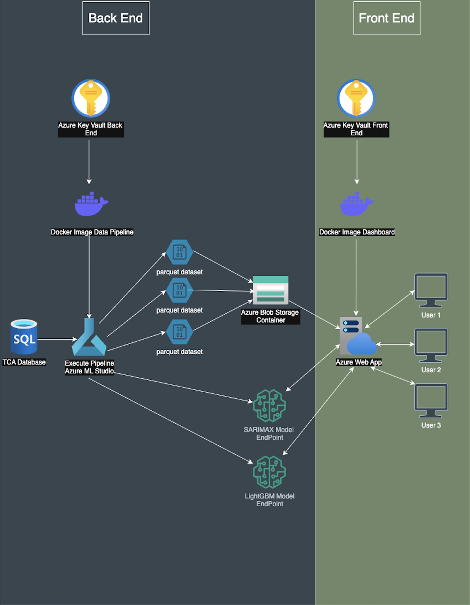

# Oumaji_Final_Project
Este repositorio contiene la solución del equipo **Oumaji** para el reto con el Socio Formador **TCA Software Solutions** para el Bloque **Desarrollo de proyectos de ingeniería matemática (Gpo 502)**
## Solución Propuesta
La solución de nuestra propuesta consiste en lo siguiente:
Construimos una solución completamente hosteada en azure en la cual contamos con un `back-end` de una pipelina programada en el framework de kedro y hosteada en azure machine learning studio. Esta toma los datos del socio formador de una base de datos de sql y devuelve dos model endpoints, y 4 datasets guardados en un azure blob storage. La parte de `front-end` utilizamos streamlit para desarrollar el UI de la interfaz y la estamos hosteando en Azure Web App service. La siguiente Imagen es un diagrama de nuestra solución. 

## Recursos de Azure necesarios para replicar esta aplicación
Esta una lista de todos los recursos de Azure que utilizamos para implementar nuestra solución. En cada folder habran mas instrucciones acerca de como crear cada recurso.
- Azure subscription ID
- Azure Resource Group
- Azure Container Registry
- Azure Machine Learning Workspace
- Azure Key Vault
- Azure Storage Account
- Azure Web App Service
- Azure Compute Cluster

## Estructura y contenidos del Repositorio
En este Repositorio contamos con 4 folders cada una para diferentes partes del desarrollo. 
### Folders de Desarrollo y Experimentación
En los siguientes directorios puedes ver el codigo que utilizamos para desarrollo y experimentación:
- **`Notebooks_Development`**
    En el folder de `Notebooks_Development` puedes encontrar diferentes Jupyter Notebooks donde desarrollamos diferentes modelos de machine learning. En el `Readme.md` de este directorio puedes encontrar las instrucciones para crear un contenedor de mlflow local y poder ver las metricas y parametros de todos los modelos que desarrollamos en la etapa de experimentación. Si tienes interes en ver los resultados de todos los modelos que desarrollamos revisa ese directorio.
- **`data-preprocessing-pipeline`**
    En el folder `data-preprocessing-pipeline` puedes encontrar el proyecto de kedro que desarrollamos localmente. En este folder experimentamos antes de crear nuestra pipeline final que fue desplegada en azure. 
## Folders de Despliegue en la nube.

- **`azurepipelinedevelopment`**
    En el folder `azurepipelinedevelopment` puedes encontrar la pipeline de kedro que fue desplegada en Azure Machine Learning y las instrucciones para replicar esta pipeline en tu cuenta de azure.
- **`front_end_dashboard_and_API`**
    En el folder `front_end_dashboard_and_API` puedes encontrar el codigo de la aplicación de streamlit, y las instrucciones para desplegar tu propio contenedor.

## Instrucciones para replicar proyecto
1. Abre tu IDE en el directorio `azurepipelinedevelopment` y sigue las instrucciones del `Readme.md` de ese repositorio.
2. Abre tu IDE en el directorio `front_end_dashboard_and_API` y sigue las instrucciones del `Readme.md` de ese repositorio.