# azurepipelinedeployment
Este directorio contiene las instrucciones para poder desplegar esta pipeline en azure machine learning studio. **Porfavor abrir tu IDE en este directorio.**

## Crear Recursos necesarios  en Azure 
1. **Azure Subscription ID**
Crear un subscription id en azure

2. **Azure Resource Group**
crear un resource group
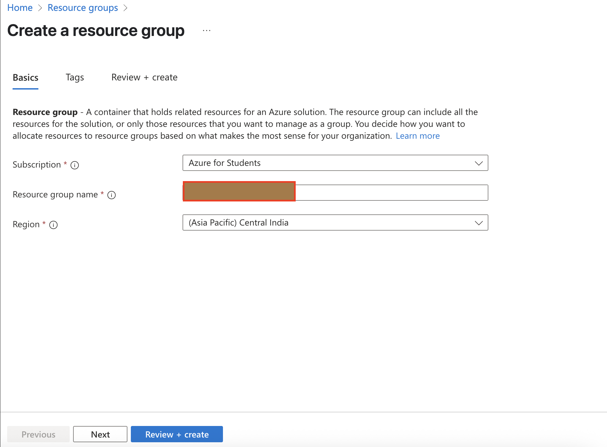
3. **Dentro de mi **Resource Group** agregar recursos** 
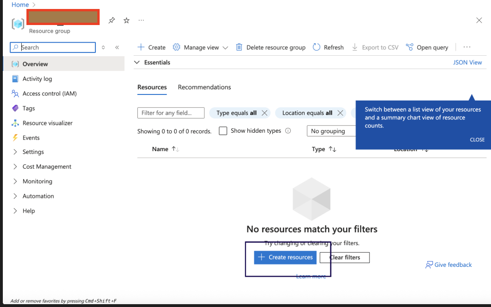
Tenes que revisar si ya tenes recursos creados para las siguientes opciones. Si no crealos.
Necesitas 
4. **storage acount**
5. **key vault**
6. **container registry**

7. **Azure ML workspace**
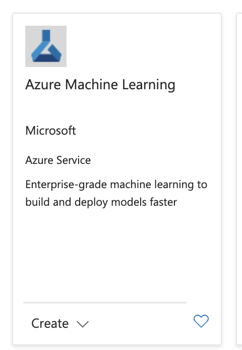
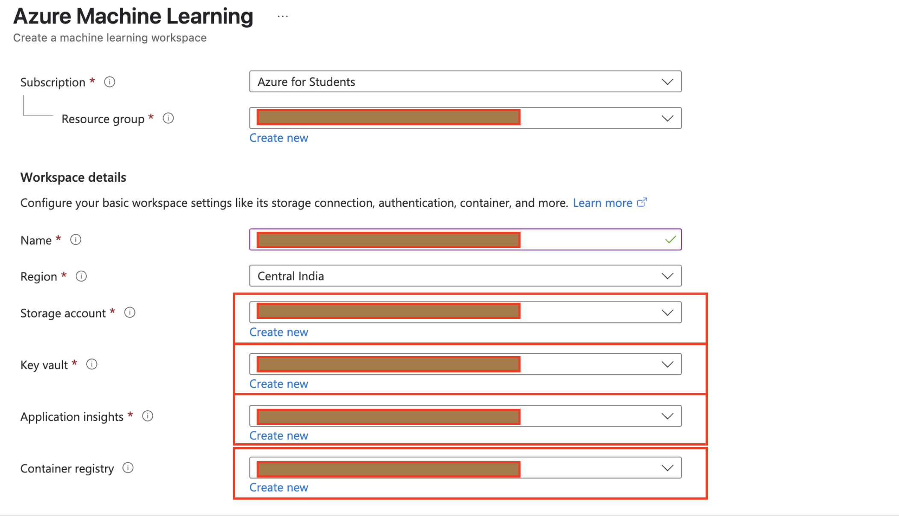


asi se debe ver mi resource group
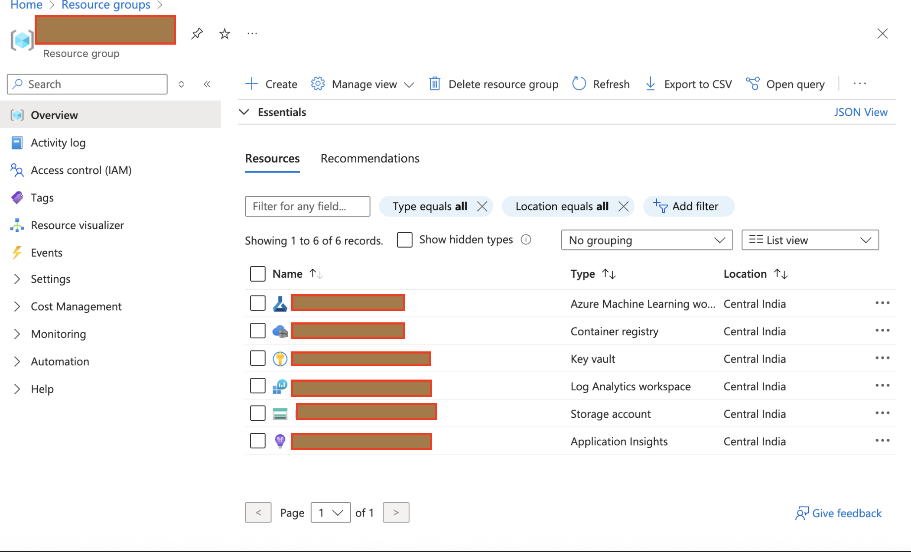
8. **Azure ML Compute Cluster**

Debo abrir Azure Machine Learning Studio 
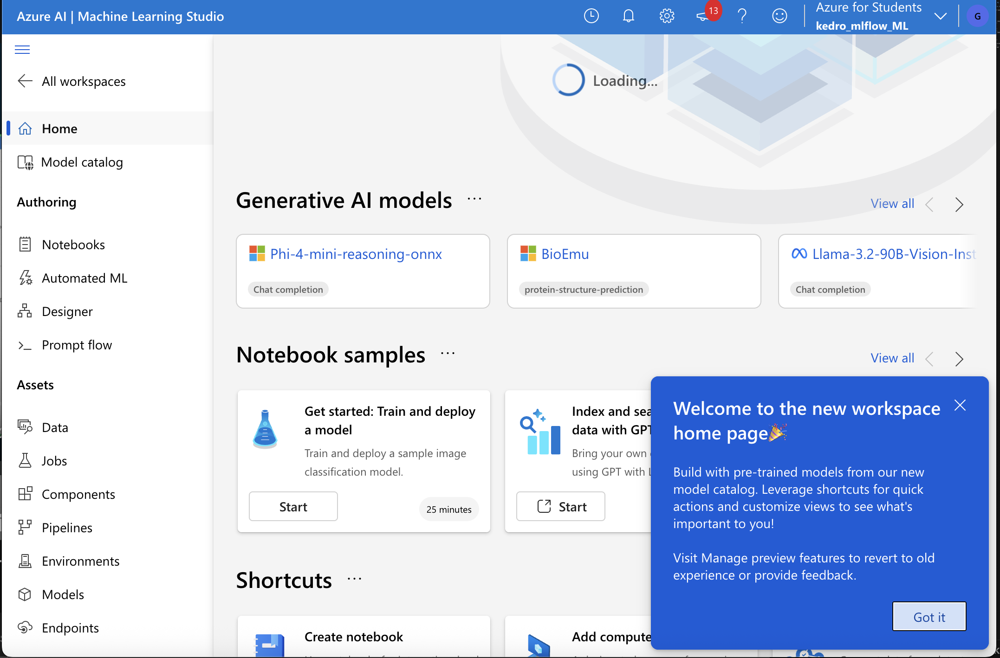
y crear un compute cluster en este apartado
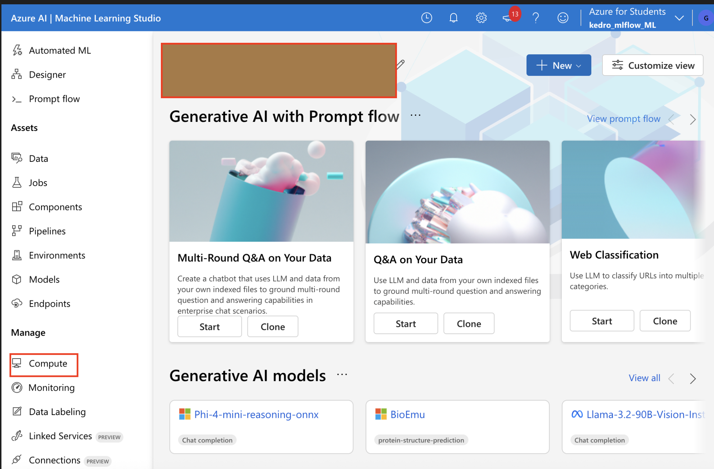
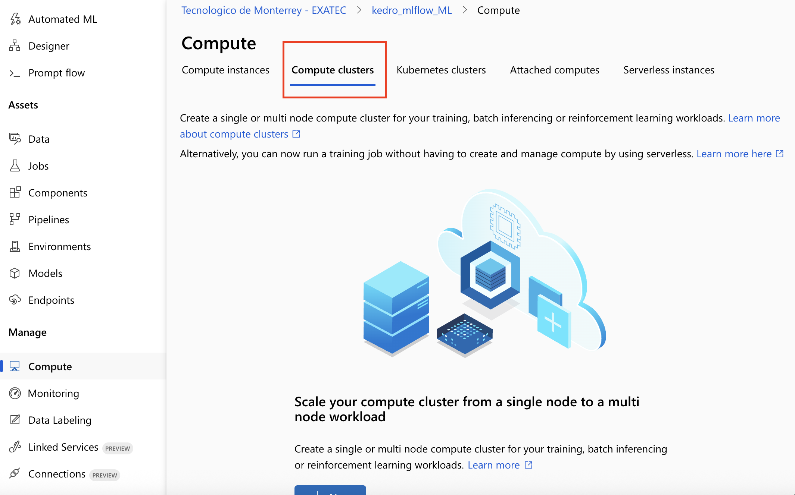
en manage identity
seleccionar las opcines default 
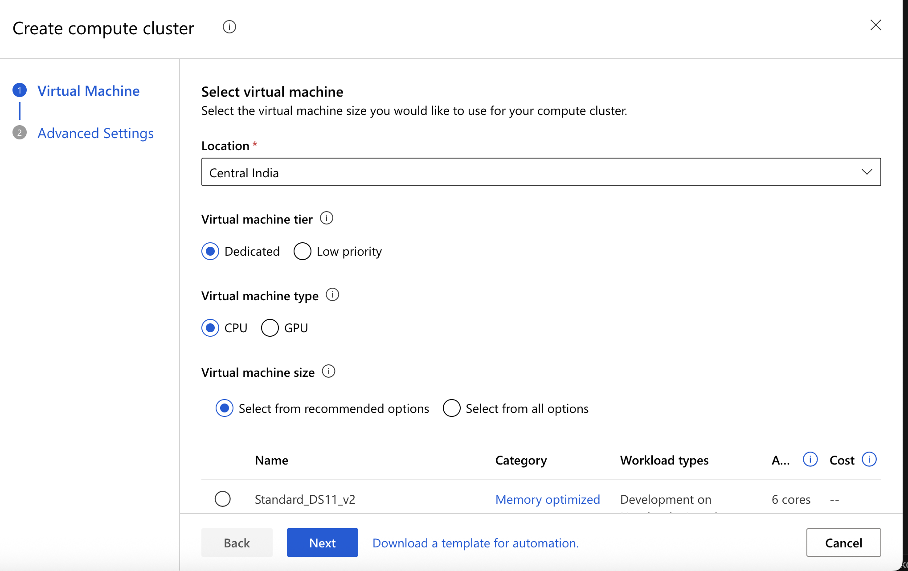

aqui igual default options 
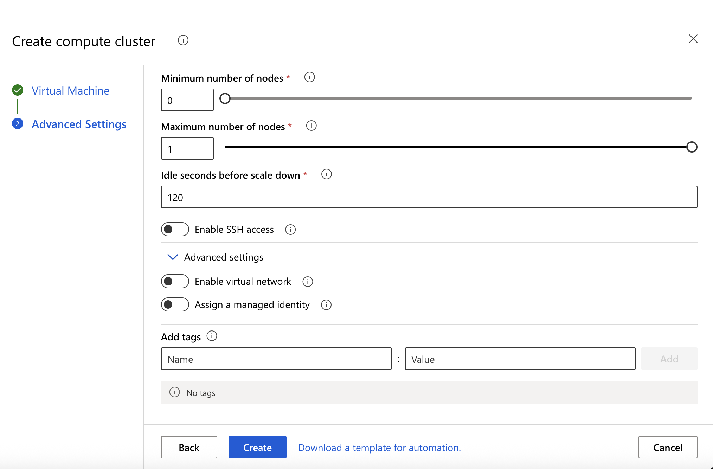

en manage identity seleccionar de mi computer `System assigned identity`
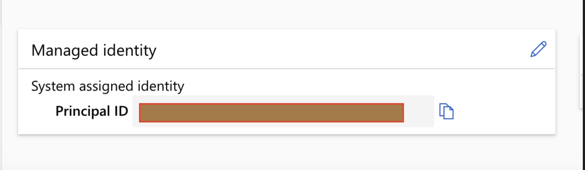


9. **Configurar mi container registry**
Debo Configurar mi container registry para que mi `Compute Cluster` pueda jalar la imagen de mi kedro pipeline. 
- Go to your Azure Container Registry  in the Azure Portal.

- Navigate to Access control (IAM) > Role assignments > + Add > Add role assignment.

- In the form:

- Role: Select AcrPull

- Assign access to: Choose Managed identity

- Select members: Click "Select members" and search for the name of your AML compute (should now appear since you just enabled identity)

- Click Review + assign to save.
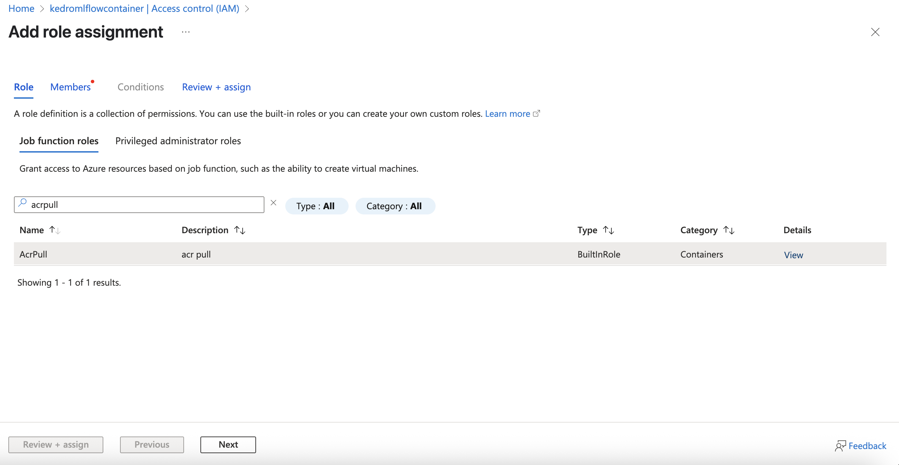
- Click the “Next” button (bottom right of your screen).

- Under Members, select:

- Managed identity esta es el `Principal ID` de tu compute cluster que creaste en el paso 8.

y se tiene que ver algo asi tu pantalla donde seleccionaste tu Azure Machine Learning resource
Continue with Review + assign and click Assign to complete.

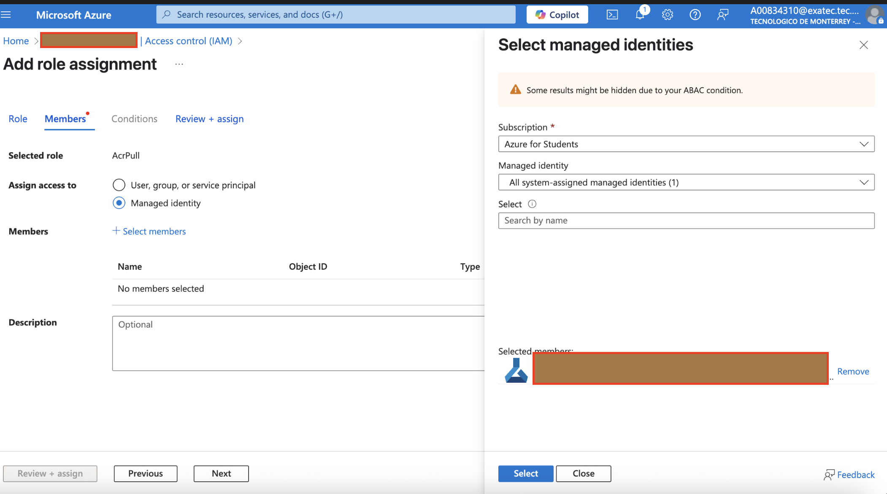

y despues hay que restart el computer cluster.

10. **Crear Blog Storage**
El Blob storage es necesario para guardar los datasets que vas a utilizar en tu dashboard. De esta manera los outputs de las funciones de la pipeline estaran en un lugar ylos puedes mandar a llamar desde tu dashboard.
 
Debo crearlo dentro del **storage account** que cree en el **paso 4**. 
- me muevo a mi `storage account`
- selecciono la opcion de `+ Containers`  en el search bar
-  creo un nuevo contenedor debo llamarlo `pipeline-outputs`
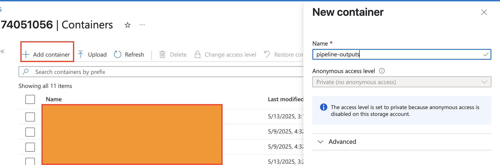
 
Guarda el nombre de tu blob storage lo necesitaras cuando configures tu `catalog.yml`

## Configuración de tu key vault
La `Key Vault` tiene una función muy importante dentro del proyecto. Todos los id's de las credenciales que creamos en la sección pasada deben de estar escondidas en el codigo. Por motivos de seguridad. Es por eso que los valores o identificadores de estos recursos deben de ser guardados en la key vault. 

### Agregar Credenciales o Secrets a tu Key Vault
En esta sección estaran los comandos para agregar credenciales a mi key vault para eso tengo que darle el permiso a mi azure machine learning worspace de extraer , y agregar credenciales.
1.  **Abro una terminal limpia y hago login a Azure**
```
az login
```
el siguiente comando solo es necesario correrlo una vez
```
az extension add --name ml
```
2. **Actualizo la Identidad de mi Azure Machine Learning Worskpace** Con el fin de conseguir el `Principal ID` de mi Workspace

```
az ml workspace update \
  --name <azureml-workspace-name> \
  --resource-group <your-resource-group-name> \
  --set identity.type=SystemAssigned
```
3. **Extraer el Principal ID de mi AML Worskapce**
Este comando te enseñara un id debes guardarlo para el siguiente comando y remplazarlo en el lugar de <azureml-workspace-principal-id>
```
az ml workspace show \
  --name <azureml-workspace> \
  --resource-group <your-resource-group> \
  --query identity.principal_id \
  -o tsv
```
4. **Darle permiso de acceso de mi Key Vault a mi AML Workspace**
```
az keyvault set-policy \
  --name <your-key-vault-name> \
  --object-id <azureml-workspace-principal-id> \
  --secret-permissions get list
```
5. **Darle permiso de agregar credenciales a mi AML Workspace**

```
az keyvault set-policy \
  --name <key-vault-name> \
  --upn <correo-de-azure> \
  --secret-permissions get list set

```

6. **Agregar todas las credenciales a mi key vault desde la terminal**
**IMPORTANTE**
En el siguiente formato debes remplazar el valor `<your-key-vault-name>` y todos los valores despues de `--value "<your-subscription-id>"` por su valor original en este caso `<your-subscription-id>` lo remplazas por su valor original. 

```
az keyvault secret set --vault-name <your-key-vault-name> --name subscription-id        --value "<your-subscription-id>"
az keyvault secret set --vault-name <your-key-vault-name> --name resource-group        --value "<your-resource-group>"
az keyvault secret set --vault-name <your-key-vault-name> --name workspace-name        --value "<your-workspace-name>"
az keyvault secret set --vault-name <your-key-vault-name> --name storage-account-name  --value "<your-storage-account-name>"
az keyvault secret set --vault-name <your-key-vault-name> --name storage-account-key   --value "<your-storage-account-key>"
az keyvault secret set --vault-name <your-key-vault-name> --name storage-container   --value "<your-storage-container-name>"
az keyvault secret set --vault-name <your-key-vault-name> --name cluster-name          --value "<your-compute-cluster-name>"
```
7. **Agregar a mi Azure ML Workspace como Key Vault Secret User**
- Voy a mi `key vault` en mi `azure portal `

- despues `Acces Control (IAM)`
- despues add role assignment
- agrego uno y busco  y selecciono `Key Vault Secrets User`
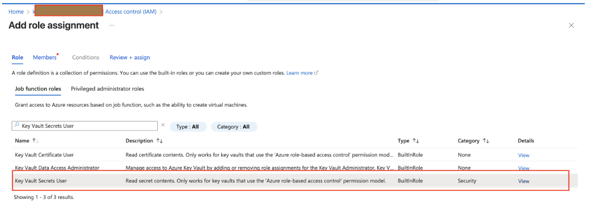
- Despues de seleccionarle me muevo al `Memebers` Tab
Selecciono los siguientes parametros:
- Choose Managed identity.
- Click Select members.
- In the search box, find your Azure ML workspace’s managed identity
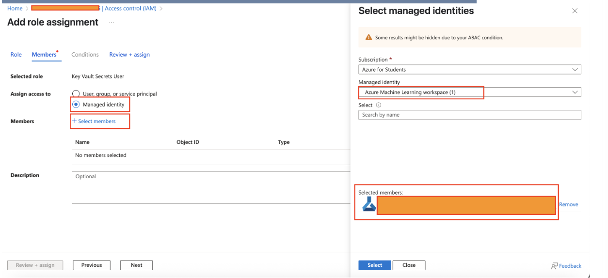
### Darle acceso a a mi **Compute Cluster** de accesar a mi **Key Vault**
1. **Encuentro el `Principal ID` de mi `Compute Cluster` lo puedes ver desde el portal de Azure Machine Learning**
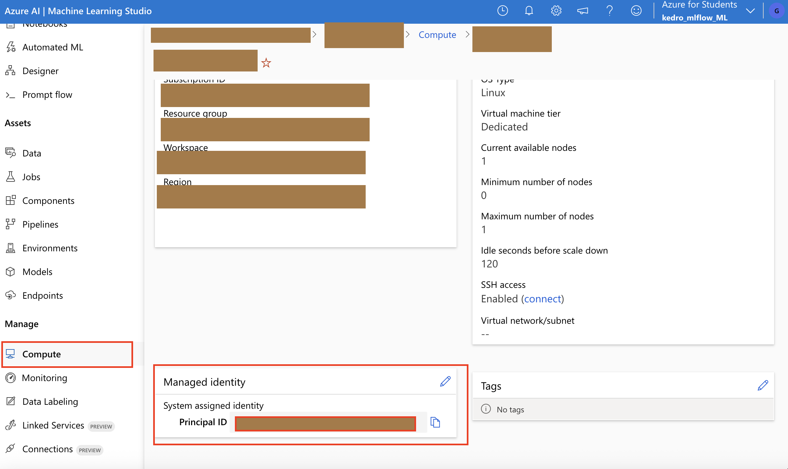
Guardalo y remplazalo en el siguiente comando en lugar de <azure-compute-cluster-principal-id>
2. **Darle Acceso a mi `Compute Cluster` de accesar a secretos de mi Key Vault**
```
az keyvault set-policy \
  --name <key-vault-name> \
  --object-id <azure-compute-cluster-principal-id> \
  --secret-permissions get list
```
### Darle acceso a a mi **Compute Cluster** de accesar a mi **Azure Container Registry**
1. **Conseguir la Manage Identity de mi `Azure Container Registry**
Este comando te va a devolver un valor remplazalo en el siguiente comando en lugar de <ACR_ID>
```
az acr show \           
  --name <acr-name> \
  --query id \
  --output tsv
```
2. **Darle acceso a mi compute cluster de jalar imagenes de  mi `ACR`**
```
az role assignment create \
  --assignee <azure-compute-cluster-principal-id> \
  --role "AcrPull" \
  --scope <ACR_ID>

```
### Declarar un experimento de Mlflow
En este caso utilice la **example pipeline de kedro** me voy a mi pipeline de datascience para declarar mi experimento de mlflow en este directorio `src/kedroazuremldemo/pipelines/data_science/nodes.py`

1. **Configurar mis credenciales para que mi AML Workspace pueda seguir mis experimentos**
este comando me va a devolver un uri debes guardarlo lo vas a utilizar en tu `azureml.yml`
```
az ml workspace show \
  --name <workspace> \
  --resource-group <rg> \
  --query mlflow_tracking_uri -o tsv

```
este uri debes agregarlo en tu **azureml.yml** en el lugar donde dice `<mlflow-workspace-uri>` a la par del environment variable `MLFLOW_TRACKING_URI` y `MLFLOW_REGISTRY_URI` . Azure necesita uri para saber donde guardar los experimentos de mlflow necesita ser ingresado como variables de entorno.

## Subir archivos a mi azure blob storage.
Debo descargar las siguientes tablas del servidor de sql del socio formador guardarlos como csv y subirlos en mi blob storage llamado  `pipeline-outputs`. Descargar las tablas :
- `iar_reservaciones`
- `iaab_Detalles_Vtas`
Puedo agregar manualmente desde el Azure Portal los csv
1. **Me muevo a mi azure blob storage llamdo `pipeline-outputs`**
2. creo un directorio llamado `01_raw`
3. subo manualmente los archivos de las tablas en tipo `.csv`
4. renombre los archvios por lo siguiente 
- `iaab_Detalles_Vtas.csv` -> `iaab_Detalles_Vtas-1.csv`
- `iar_reservaciones.csv` -> `iar_reservaciones-1.csv`


## Archivos necesarios para subir un `Job` a Azure Machine Learning Workspace
Para poder ejecutar esta pipeline debo crear una `JOB` en azure machine learning studio. para esto necesitas un archivo llamado `azureml.yml` en el archivo `azureml.yml` contiene las instrucciones que va a seguir mi compute cluster de azureml.yml para correr mi imagen con mi proyecto. En esta seccion se presentaran todos los archivos necesarios para ejecutar la job en aml workspace y como mandar las **credenciales de mi key vault a mi imagen de doocker cuando es ejecutada en azure machine learning**

### Crear tu **azureml.yml** al mismo nivel que tu dockerfile

En el `azureml.yml` es el unico lugar donde vas a declarar credenciales explicitamente. Este archivo esta en tu `dockerignore` no va a estar en tu imagen asi los secretos estan seguros. Debes remplazar ciertos valores. Recuerda el uri para mlflow que conseguiste en la seccion anterior.
```
$schema: https://azuremlschemas.azureedge.net/latest/commandJob.schema.json
type: command

experiment_name: <name-you-want-for-your-experiment>
display_name:    <name-you-want-for-your-experiment>

# Where to run
compute: azureml:<compute-cluster-name>

# Which Docker image to use
environment:
  image: <acr-name>.azurecr.io/<image-name>:latest

# Code & command
code: .
command: python -m kedro run --env=azureml

# ← SET YOUR STORAGE AND KEYVAULT SECRETS HERE
environment_variables:
  STORAGE_ACCOUNT_NAME:  <storage-account-name>
  STORAGE_ACCOUNT_KEY:   <storage-account-key>
  KEYVAULT_URI:          https://<key-vault-name>.vault.azure.net/
  MLFLOW_TRACKING_URI: <mlflow-workspace-uri>
  MLFLOW_REGISTRY_URI: <mlflow-workspace-uri>
  KEDRO_LOGGING_CONFIG: "conf/logging.yml"

# (Optional) to tag and filter runs
tags:
  purpose: "kedro-prod"
  trigger: "python -m kedro run --env=azureml"

```

1. **Correr este comando en mi terminal**

```
chmod +x entrypoint.sh
```

## Ejecutar pipeline en Azure Machine Learning Workspace
Ya tienes todo lo necesario para ejecutar pipeline en azure machine learning workspace. Solo debes correr los siguientes commandos. Debes correrlos desde la terminal de tu proyecto de kedro.
1. **Login a azure y a tu acr donde vas a guardar tu imagen**

```
az login
```

```
az acr login \
  --name <acr-name> \
  --resource-group <resource-group-name>

```
2. **Construir y pushear imagen**
Esto solo debes correrlo una vez para construir una imagen compatible con azure
```
docker buildx create --name multiarch-builder --use
```
```
docker buildx build \
  --platform linux/amd64 \
  --no-cache \
  --tag <nombre-acr>.azurecr.io/<nombre-imagen>:latest \
  --push .
```
3. **Ejecutar la `JOB` en Azure Machine Learning Studio**
Al correr este comando veras un json si se ejecuta correctamente. Este comando utiliza tus instrucciones del archivo `azureml.yml` y se ejecuta en Azure Machine Learning studio ahi podras ver la ejecución de tu pipeline.

```
az ml job create \
  --file azureml.yml \
  --resource-group    <nombre-resource-group> \
  --workspace-name    <nombre-aml-workspace>  
```


## Como puedo schedule un job para que se ejecute cada n dias Creando una pipeline
**IMPORTANTE**
Hasta ahora tu estabs ejecutando un Job del tipo command. Para poder crear un **Schedule** que tu pipeline se ejecute todos los jueves a las 8:00 am por ejemplo tenes que convertir ese job del tipo command a un job del tipo **PIPELINE**
1. **Actualizo mi `azureml.yml`**
```
# azureml.yml
$schema: https://azuremlschemas.azureedge.net/latest/pipelineJob.schema.json
type: pipeline

jobs:
  run_kedro:
    type: command
    compute: azureml:<nombre-compute-cluster>
    environment:
      image: <nombre-acr>.azurecr.io/<nombre-imagen>:latest
    code: .
    command: python -m kedro run --env=azureml
    environment_variables:
      STORAGE_ACCOUNT_NAME:  <storage-account-name>
      STORAGE_ACCOUNT_KEY:   <storage-account-key>
      KEYVAULT_URI:          https://<key-vault-name>.vault.azure.net/
      MLFLOW_TRACKING_URI: "<mlflow-workspace-uri>"
      MLFLOW_REGISTRY_URI: "<mlflow-workspace-uri>"
      KEDRO_LOGGING_CONFIG: "conf/logging.yml"
    tags:
      purpose: "kedro-prod"
      trigger: "python -m kedro run --env=azureml"

```
2. **Creo mi job del tipo pipeline**
```
az ml job create \
  --file azureml.yml \
  --resource-group    <nombre-resource-group> \
  --workspace-name    <nombre-aml-workspace>  
```
3. **Me voy azure machine learning studio y veo como ahora mi job es un pipeline que puede tener un schedule de ejecucion**
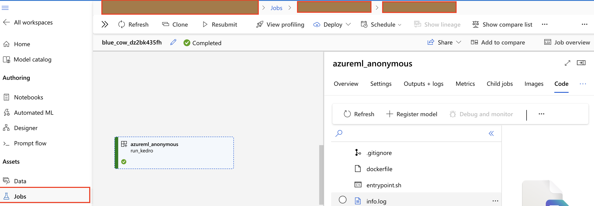


## Crear real time endpoints para mis modelos.
Debes crear un real time endpoint para mis modelos
para el lightgbm debes nombrarlo `tca-software-m-lightgbm` y para el modelo sarimax debes nombrar el endpoint `tca-software-ml-sarimax`
1. ir al modelo registrado y seleccionar Real Time Endpoint
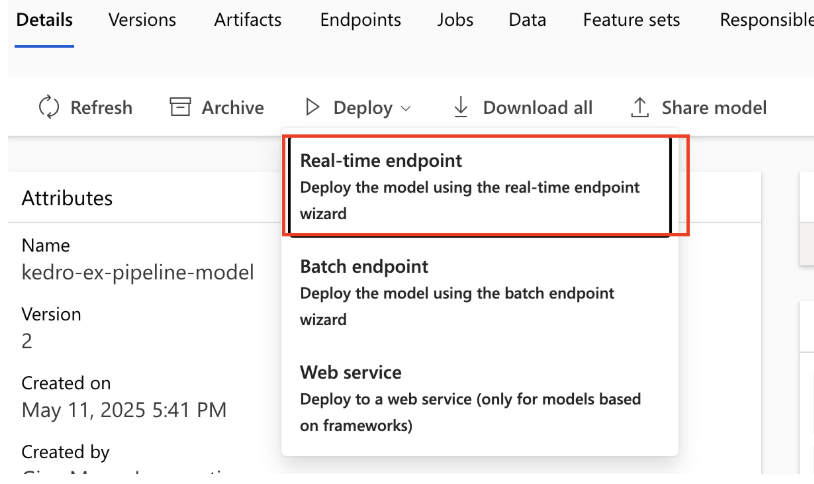
2. configyrar el endpoint con los siguientes parametros
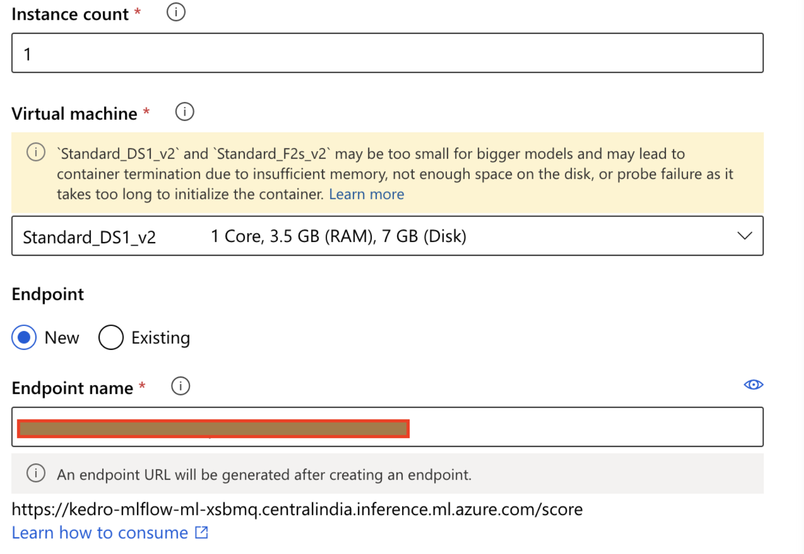
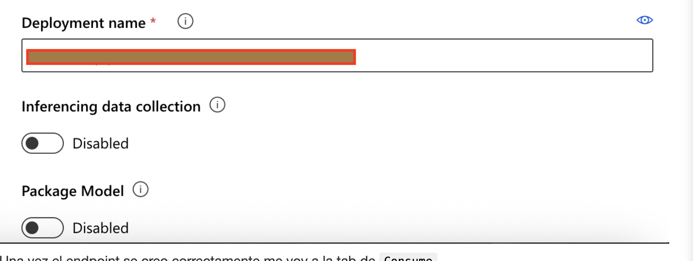

3. Una vez el endpoint se creo correctamente me voy a la tab de `Consume`
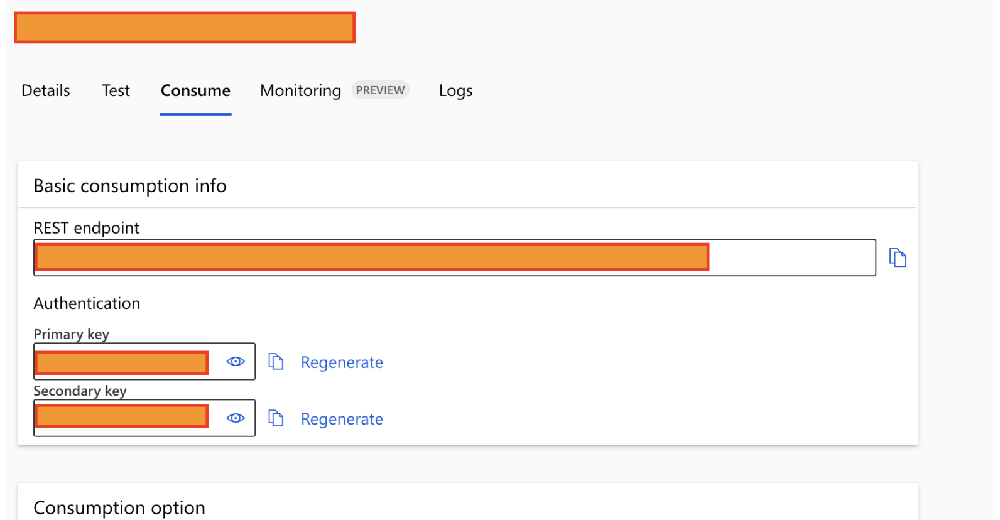
Ahi puedo encontrar el:
- `REST EndPoint URI`
- `Primary Key`
Guarda estos para el desarrollo del dashboard.